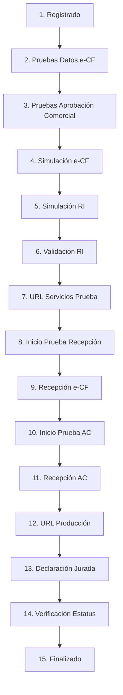

# Certification Process for Electronic Issuers

> **Original**: Proceso de Certificación para ser Emisor Electrónico  
> **Source**: [Proceso de Certificacion para ser Emisor Electronico.pdf](file:///home/romulo/visual/ecf/ecf-docs/Documentaciones%20Proceso%20de%20Certificaci%C3%B3n%20FE/Proceso%20de%20Certificacion%20para%20ser%20Emisor%20Electronico.pdf)

---

## Overview

To become an authorized electronic issuer (Emisor Electrónico) in the Dominican Republic, taxpayers must complete a certification process through the DGII's Virtual Office portal.

---

## Process Phases

| Phase | Description |
|-------|-------------|
| **Solicitud** | Initial application via Virtual Office (OFV) |
| **Set de Pruebas** | Technical validation in Certification environment |
| **Certificación** | Final authorization and enablement |

---

## Prerequisites

Before starting the certification process, you must:

| Requirement | Description |
|-------------|-------------|
| ✅ RNC Registration | Registered in National Taxpayer Registry |
| ✅ Virtual Office | Active account with access to OFV |
| ✅ NCF Authorization | Authorized to issue fiscal documents |
| ✅ Digital Certificate | Valid certificate for tax procedures |
| ✅ Software | Electronic invoicing software (internal or provider) |
| ✅ Tax Compliance | Current with all tax obligations |

---

## Testing Requirements

The technical tests (Set de Pruebas) validate:

| Test Area | Description |
|-----------|-------------|
| **e-CF Data** | XML structure and content validation |
| **Commercial Approval** | Accept/reject message handling |
| **Simulations** | End-to-end document flows |
| **Printed Representation** | Physical/PDF output compliance |
| **Web Services** | Endpoint verification for receiving e-CFs |

---

## The 15-Step Certification Flow

### Step Details

| Step | Name | Description |
|------|------|-------------|
| 1 | **Registrado** | Enter software details and service URLs |
| 2 | **Pruebas de Datos e-CF** | Send XML samples for technical validation |
| 3 | **Pruebas de Datos Aprobación Comercial** | Send commercial approval samples |
| 4 | **Pruebas Simulación e-CF** | Simulate document emission |
| 5 | **Pruebas Simulación Representación Impresa** | Simulate printed outputs |
| 6 | **Validación Representación Impresa** | DGII review of printed representation |
| 7 | **URL Servicios Prueba** | Confirm testing endpoints |
| 8 | **Inicio Prueba Recepción e-CF** | Start reception test phase |
| 9 | **Recepción e-CF** | Confirm ability to receive e-CFs |
| 10 | **Inicio Prueba Recepción Aprobación Comercial** | Start response reception tests |
| 11 | **Recepción Aprobación Comercial** | Reply to DGII approvals with status "OK" or "Error" |
| 12 | **URL Servicios Producción** | Enter production endpoints |
| 13 | **Declaración Jurada** | Sign affidavit using [App Firma Digital](./digital-signature-app-guide.md) |
| 14 | **Verificación Estatus** | DGII final compliance check |
| 15 | **Finalizado** | Transition to Electronic Issuer status |

> [!NOTE]
> **Changing Representative**: If you need to change the legal representative for the process, you must cancel the current application in the portal (available in steps 1-13) with the reason "Cambio de representante" and start a new application.

---

## Technical Testing Details (Simulation Phase)

During the **Pruebas de Simulación** (Step 4), you must generate and send invoices with real-world data scenarios.

### 1. Sending e-CF
*   Send XMLs to the **Certification** reception endpoint.
*   **Consumer Invoices (<250k)**: Must be uploaded to the specific interface "Facturas de consumo < 250Mil" after sending the summary.
    *   B2C Certification Helper: `https://fc.dgii.gov.do/certecf/recepcionfc/help/index.html`

### 2. Validation Responses
When sending test documents, you will receive a `trackId`. Querying this ID yields specific states:

| State | Handling |
|-------|----------|
| **Aceptado** | Calculation/Logic is correct. Proceed. |
| **Rechazado** | Critical error. Fix and retry. |
| **Aceptado Condicional** | Accepted but with warnings (e.g., outdated tables). Fix for future. |
| **En Proceso** | Still validating. Retry query later. |

### 3. Printed Representation (RI) Validation
*   You must generate PDFs of your invoices (Representación Impresa).
*   Upload them to the certification portal.
*   **File Requirements**:
    - Format: PDF
    - Maximum size: **10MB**
    - Must include all mandatory elements (QR code, security code, legend)
*   **Approval**: If the PDF meets visual requirements (QR placement, labels, layout).
*   **Rejection**: If layout/content is incorrect. You must fix and re-upload.

**Required Elements in RI:**
- Company identification (RNC, name, address)
- e-NCF (electronic sequence number)
- QR Code for DGII verification
- Security Code (6 characters)
- Digital signature timestamp
- Legal legend: "Este documento es una representación impresa de un comprobante fiscal electrónico"

---

## Environment Types

| Environment | Purpose | Base URL |
|-------------|---------|----------|
| **Pre-certification** | Unlimited testing before formal process | `https://ecf.dgii.gov.do/testecf/` |
| **Certification** | Official 15-step validation process | `https://ecf.dgii.gov.do/certecf/` |
| **Production** | Live environment after approval | `https://ecf.dgii.gov.do/ecf/` |

**Consumer Invoice (<250k) URLs:**

| Environment | URL |
|-------------|-----|
| Pre-certification | `https://fc.dgii.gov.do/testecf/` |
| Certification | `https://fc.dgii.gov.do/certecf/` |
| Production | `https://fc.dgii.gov.do/ecf/` |

> [!TIP]
> Use the Pre-certification environment extensively before starting the formal process. Data in pre-certification is retained for **60 days**.

---

## Legal Framework

- **Law 51-23** - Establishes mandatory adoption calendar
- **Adoption Timeline**: 12-36 months based on taxpayer category

---

## Key Contacts

| Resource | Purpose |
|----------|---------|
| Virtual Office (OFV) | Portal for certification process |
| DGII Support | Technical assistance |
| Certification Authority | Digital certificate provider |
