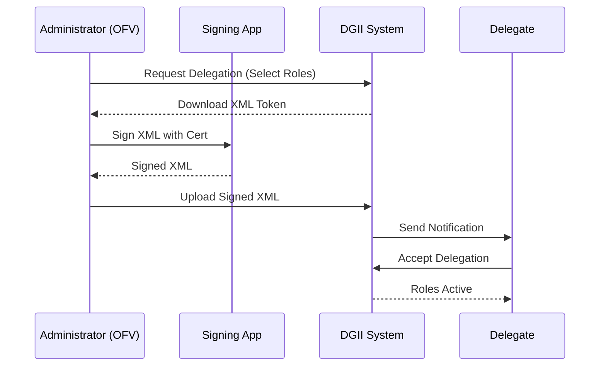

# Role Delegation Guide

> **Original**: Instructivo Delegaciones de Roles de Facturación Electrónica  
> **Source**: [Instructivo Delegaciones de Roles de Facturación Electrónica.pdf](file:///home/romulo/visual/ecf/ecf-docs/Instructivos%20sobre%20Facturaci%C3%B3n%20Electr%C3%B3nica/Instructivo%20Delegaciones%20de%20Roles%20de%20Facturaci%C3%B3n%20Electr%C3%B3nica.pdf)  
> **Version**: 2.0  
> **Date**: June 2025

---

## Overview

Taxpayers (issuers) can delegate specific responsibilities to other individuals (physical persons) to manage their Electronic Invoicing accounts. This is critical for separating duties (e.g., IT signs the XMLs, Accounting approves commercial invoices).

---

## Available Roles

| Role | Spanish Name | Description |
|------|--------------|-------------|
| **Administrador** | Administrador | Can manage delegations and account settings in the Virtual Office (OFV). Can assign roles to others. |
| **Firmante** | Firmante Autorizado | Authorized to **digitally sign** e-CF documents on behalf of the company. The digital certificate used for signing must belong to this person. |
| **Aprobador Comercial** | Aprobador Comercial | Authorized to **accept or reject** commercial invoices (ACECF) received from suppliers. |
| **Solicitante Autorizado** | Solicitante Autorizado | General role for requesting NCF sequences or other administrative tasks. |

> [!TIP]
> The administrator can assign **all roles to themselves** if needed, or distribute them to different representatives.

> [!IMPORTANT]
> The delegate must be a specific **Physical Person** (Persona Física) who is already linked to the Taxpayer's RNC as a representative.

---

## Delegation Process

### Step 1: Initiate Delegation (Administrator)
1.  Log in to the **Virtual Office (OFV)**.
2.  Go to `Delegación de e-CF` > `Delegación de Roles`.
3.  Enter the **Cedula/RNC** of the person to delegate.
4.  Click **Buscar**.
5.  Select the **Roles** you wish to assign (e.g., Firmante, Aprobador).
6.  Click **Aceptar**.

### Step 2: Sign the Request
1.  The OFV will generate an **Authorization XML**.
2.  **Download** this XML file.
3.  Use the **App Firma Digital** (or your own tool) to **digitally sign** this XML using the **Administrator's** digital certificate.
4.  Save the signed XML.

### Step 3: Upload Authorization
1.  Return to the OFV menu `Delegación de e-CF`.
2.  Select **Carga XML Delegación**.
3.  Upload the **signed XML**.
4.  Click **Guardar**.

### Step 4: Acceptance (Delegate)
1.  The **Delegate** must log in to their *own* Virtual Office.
2.  They will see a pending notification for the role delegation.
3.  They must click **Aceptar** to activate the roles.

---

## Diagram

